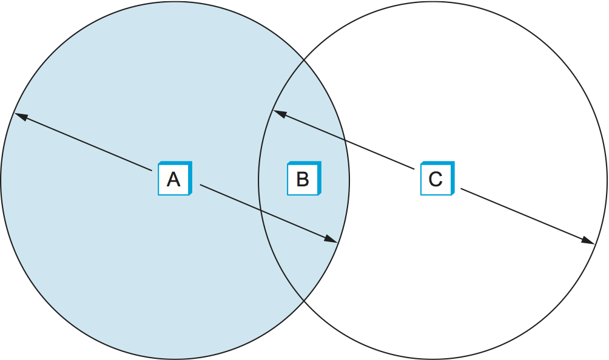
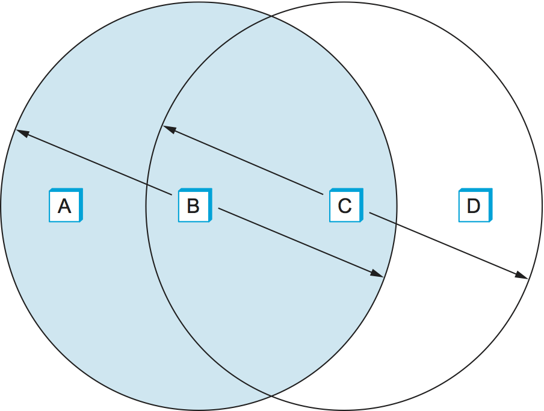

Wireless technologies are quite different from wired technologies in many ways, while at the same time sharing many common properties. Like wired links, problems of bit error are of great concern-even more due to the unpredictable noise environment of most wireless links. Unlike wired links power is a big issue of wireless, especially because wireless links are often used by small devices (like phones and sensors) that have limited power access. Furthermore there are concern about interference with other devices and usually regulations about how much power a device can emit at any given frequency.

Wireless links are also inherently multi access; it's difficult to direct a transmission to just a single receiver or to avoid receiving radio signals from any transmitter in neighborhood. Hence media access control is a central issue for wireless links. Also it's hard to control who receives your signal when you transmit over the air, issues of eavesdropping may also have to be addressed.

Bandwidth sometimes means the width of a frequency band in hertz and sometimes the data rate of a link. Since both of these concept come up in wireless networks, we'll use _bandwidth_ in its stricter sense i.e. width of the frequency band and use the term _data rate_ to describe the number of bits per second that can be sent over a link.

## Basic Issues

All wireless links share the same medium, hence the challenge is to share that medium efficiently, without unduly interfering with each other. Most of this sharing is accomplished by dividing the dimensions of frequency and space. Exclusive use of a particular frequency in a particular geographic area may be allocated to a single entity. To limit the area covered by an electromagnetic signal the power of the transmitter can by reduced. These allocations are typically determined by government agencies.

One idea to prevent (or lower) the interference from other devices is to use _spread spectrum_. The idea behind spread spectrum is to spread the signal over a wider frequency band, to minimize the impact of interference from other device.

One spread spectrum technique is called _frequency hopping_. It involves transmitting the signal over a (pseudo)random sequence of frequencies, these frequencies are generated by a pseudorandom number generator. The receiver uses the same algorithm as the sender and initializes it with the same seed, hence it is able to hop frequencies in sync with the transmitter to correctly receive the frame. This reduces the interference because it's unlikely that two signals would be using the same frequency for more than the infrequent isolated bit.

A second spread spectrum technique, called _direct sequence_, adds redundancy for greater tolerance of interference. Each bit of data is represented by multiple bits in the transmitted signal so that, if some of the transmitted bit are damaged by interference, there is usually enough redundancy to recover the original bit. For each bit the sender wants to transmit, it actually sends the exclusive-OR (XOR) of that bit and n random bits. As with frequency hopping, the sequence of random bits is generated by a pseudorandom number generator known to both the sender and the receiver. The transmitted values, known as an n-bit chipping code, spread the signal across a frequency band that is n times wider than the frame would have otherwise required.

  

## Wi-Fi (802.11)

The original 802.11 defined two radio-based physical layer standards, one using frequency hopping and other using direct sequence technique. Both with data rates in the 2 Mbps range. Subsequently, 802.11b was added, as using a variant of direct sequence, supported up to 11 Mbps. These standards all operated in the 2.4 GHz frequency band. Then came 802.11a which delivered up to 54 Mbps using a variant of frequency division multiplexing called _orthogonal frequency division multiplexing_ (OFDM), 802.11a runs in the 5 GHz band. After this there have been many new versions like 802.11(g/n/ac/ax) etc. Most of the devices supports multiple versions of 802.11 to ensure compatibility with older devices and to also choose the highest bandwidth (width of the frequency band, not data rate) option for a particular environment.

### Collision Avoidance

At first it might seem that a wireless protocol would follow the same algorithm as the Ethernet, wait for the link to be idle before transmitting and back off should a collision occurs, and to a first approximation this is what 802.11 does. The additional complication for wireless is that, while a node on an Ethernet receives every other node's transmissions and can transmit and receive at the same time, neither of these conditions holds for wireless nodes. This makes detection of collisions rather more complex. The reason why wireless nodes cannot usually transmit and receive at the same time (on the same frequency) is that the power generated by the transmitter is much higher than any received is likely to be and so swamps the receiving circuitry. The reason why a node may not receive transmissions from another node is because that node may be too far away or blocked by an obstacle.

##### Hidden and Exposed Node Problem

Consider the situation in the left figure (*hidden node problem*), where A and C are both withing range of B but not each other. Suppose A and C both sends B a frame. Because A and C are unaware of each other neither A nor C will be aware of the collision of their frames at B. Such nodes are said to be hidden nodes with respect to each other.

  <figure>
    
    
    <figcaption>Hidden Node Problem &nbsp; &nbsp; &nbsp; Exposed Node Problem</figcaption>
  </figure>

A related problem, called *exposed node problem* occurs under the circumstances illustrated in the right figure, where each of the four nodes is able to send and receive signals that reach just the nodes to its immediate left and right. For example, B can exchange frames with A and C but it cannot reach D, while C can reach B and D but not A. Suppose B is sending to A. Node C is aware of this communication because it hears B’s transmission. It would be a mistake, however, for C to conclude that it cannot transmit to anyone just because it can hear B’s transmission. For example, suppose C wants to transmit to node D. This is not a problem since C’s transmission to D will not interfere with A’s ability to receive from B. (It would interfere with A sending to B, but B is transmitting in our example.)

