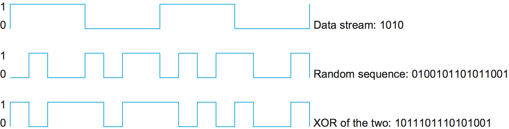

Wireless technologies are quite different from wired technologies in many ways, while at the same time sharing many common properties. Like wired links, problems of bit error are of great concern-even more due to the unpredictable noise environment of most wireless links. Unlike wired links power is a big issue of wireless, especially because wireless links are often used by small devices (like phones and sensors) that have limited power access. Furthermore there are concern about interference with other devices and usually regulations about how much power a device can emit at any given frequency.

Wireless links are also inherently multi access; it's difficult to direct a transmission to just a single receiver or to avoid receiving radio signals from any transmitter in neighborhood. Hence media access control is a central issue for wireless links. Also it's hard to control who receives your signal when you transmit over the air, issues of eavesdropping may also have to be addressed.

## Basic Issues

All wireless links share the same medium, hence the challenge is to share that medium efficiently, without unduly interfering with each other. Most of this sharing is accomplished by dividing the dimensions of frequency and space. Exclusive use of a particular frequency in a particular geographic area may be allocated to a single entity. To limit the area covered by an electromagnetic signal the power of the transmitter can by reduced. These allocations are typically determined by government agencies.

One idea to prevent (or lower) the interference from other devices is to use _spread spectrum_. The idea behind spread spectrum is to spread the signal over a wider frequency band, to minimize the impact of interference from other device.

One spread spectrum technique is called _frequency hopping_. It involves transmitting the signal over a (pseudo)random sequence of frequencies, these frequencies are generated by a pseudorandom number generator. The receiver uses the same algorithm as the sender and initializes it with the same seed, hence it is able to hop frequencies in sync with the transmitter to correctly receive the frame. This reduces the interference because it's unlikely that two signals would be using the same frequency for more than the infrequent isolated bit.

A second spread spectrum technique, called _direct sequence_, adds redundancy for greater tolerance of interference. Each bit of data is represented by multiple bits in the transmitted signal so that, if some of the transmitted bit are damaged by interference, there is usually enough redundancy to recover the original bit. For each bit the sender wants to transmit, it actually sends the exclusive-OR (XOR) of that bit and n random bits. As with frequency hopping, the sequence of random bits is generated by a pseudorandom number generator known to both the sender and the receiver. The transmitted values, known as an n-bit chipping code, spread the signal across a frequency band that is n times wider than the frame would have otherwise required.

  

